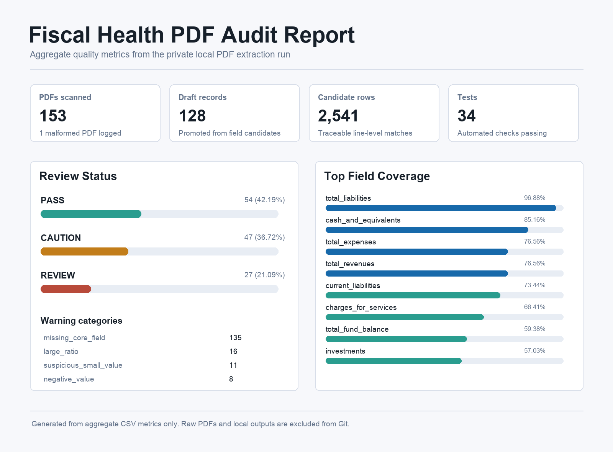

# DevTech Fiscal Health Pipeline

Portfolio-ready Python pipeline for extracting local government financial data
from CAFR/ACFR PDFs, normalizing it into an analysis-ready schema, computing
Virginia fiscal health ratios, and auditing draft extraction quality.

The repository is intentionally public-safe: it includes source code,
synthetic examples, documentation, and aggregate audit metrics, but excludes raw
private PDFs, Supabase credentials, generated review outputs, and legacy class
exports.

## Highlights

- Extracts fiscal field candidates from messy municipal PDF text using
  traceable page and line-level matches.
- Promotes candidates into a canonical fiscal schema while preserving selected
  source lines for analyst review.
- Computes 12 Virginia fiscal health ratios with missing-value and zero-
  denominator handling.
- Flags draft records with missing core fields, suspicious values, negative
  values, and unusually large ratio outputs.
- Continues full-batch processing when individual PDFs are malformed by logging
  extraction errors instead of failing the run.
- Generates aggregate audit summaries and a static HTML report for portfolio
  screenshots.

## Tech Stack

- Python 3.10+
- pdfplumber for PDF text extraction
- pandas-ready CSV outputs
- pytest for automated tests
- Supabase Storage backup/restore scripts for private local document workflows

## Project Goal

Local government financial reports are often published as PDFs with inconsistent
tables, terminology, and layouts. This project aims to make fiscal health
analysis more repeatable by turning those reports into structured fields and
ratio outputs that analysts can review, compare, and visualize.

## Planned Workflow

```text
CAFR / ACFR report
        |
        v
Document ingestion
        |
        v
Financial field extraction
        |
        v
Schema normalization + validation
        |
        v
Draft quality review + audit summary
        |
        v
12 Virginia fiscal health ratios
        |
        v
CSV / SQL-ready outputs + dashboard-ready tables
```

## Current Repository Status

This is a working prototype with:

- synthetic CSV and JSON examples
- canonical normalization helpers
- a tested 12-ratio computation layer
- local Supabase PDF backup/restore tooling
- a PDF field candidate extractor with basic layout-noise handling
- PDF candidate promotion and draft-record quality review tooling
- full-batch audit summary tooling for private local PDF runs
- a static HTML audit report generator for portfolio screenshots
- 34 automated tests covering ingestion, extraction, promotion, validation,
  ratios, summaries, and report rendering

Next planned steps:

1. Add a dashboard screenshot generated from the local HTML audit report.
2. Improve fund-balance and government-wide revenue extraction heuristics.
3. Add Markdown parser.
4. Add a small public or synthetic dashboard dataset for safe demos.

## Local Audit Snapshot

A private local full-batch run scanned 153 PDF files, extracted 2,541 field
candidate rows, promoted 128 draft normalized records, and wrote 1,023
selected-value trace rows. The quality review classified 54 records as `PASS`,
47 as `CAUTION`, and 27 as `REVIEW`; one malformed PDF was logged without
stopping the batch.

See `docs/audit_summary.md` for the aggregate metrics. Raw PDFs and generated
outputs are intentionally excluded from Git.



## Portfolio Materials

- `docs/audit_summary.md`: aggregate full-batch audit metrics.
- `docs/resume_bullets.md`: role-specific resume bullet options.
- `docs/architecture.md`: pipeline design and component responsibilities.
- `docs/ratio_definitions.md`: definitions for the 12 fiscal health ratios.

## Repository Structure

```text
.
├── docs/
│   ├── architecture.md
│   ├── audit_summary.md
│   ├── data_dictionary.md
│   ├── project_plan.md
│   ├── ratio_definitions.md
│   ├── resume_bullets.md
│   ├── requirements.md
│   └── supabase_setup.md
├── src/
│   └── fiscal_health_pipeline/
│       ├── __init__.py
│       ├── audit_report.py
│       ├── audit_summary.py
│       ├── candidate_promotion.py
│       ├── cli.py
│       ├── ingestion.py
│       ├── normalization.py
│       ├── pdf_extraction.py
│       ├── quality_review.py
│       ├── ratios.py
│       └── schema.py
├── scripts/
│   ├── download_supabase_pdfs.py
│   ├── extract_pdf_candidates.py
│   ├── promote_pdf_candidates.py
│   ├── render_audit_report.py
│   ├── review_pdf_drafts.py
│   ├── summarize_quality_review.py
│   └── upload_supabase_pdfs.py
├── tests/
│   ├── test_audit_report.py
│   ├── test_audit_summary.py
│   ├── test_candidate_promotion.py
│   ├── test_cli.py
│   ├── test_extract_pdf_candidates_script.py
│   ├── test_ingestion.py
│   ├── test_normalization.py
│   ├── test_pdf_extraction.py
│   ├── test_quality_review.py
│   └── test_ratios.py
├── pyproject.toml
├── requirements.txt
└── README.md
```

## Quick Start

```bash
python3 -m venv .venv
source .venv/bin/activate
pip install -r requirements.txt
pytest
```

Run the synthetic example:

```bash
python -m fiscal_health_pipeline.cli \
  data/examples/synthetic_fiscal_records.csv \
  --output outputs/synthetic_ratio_results.csv
```

Run the nested JSON example and write both normalized records and ratios:

```bash
python -m fiscal_health_pipeline.cli \
  data/examples/synthetic_fiscal_records.json \
  --normalized-output outputs/synthetic_normalized_records.csv \
  --output outputs/synthetic_json_ratio_results.csv
```

Extract field candidates from private local PDFs:

```bash
PYTHONPATH=src python scripts/extract_pdf_candidates.py \
  data/raw/private/supabase_backup/testing_subset \
  --recursive \
  --limit 5 \
  --output outputs/pdf_field_candidates_sample.csv \
  --errors-output outputs/pdf_extraction_errors_sample.csv
```

Promote candidate rows into draft normalized records and review trace:

```bash
PYTHONPATH=src python scripts/promote_pdf_candidates.py \
  outputs/pdf_field_candidates_sample.csv \
  --records-output outputs/pdf_draft_normalized_records.csv \
  --trace-output outputs/pdf_draft_trace.csv
```

Review draft normalized records for missing fields and suspicious values:

```bash
PYTHONPATH=src python scripts/review_pdf_drafts.py \
  outputs/pdf_draft_normalized_records.csv \
  --output outputs/pdf_draft_quality_review.csv
```

Summarize review status, warning types, and field coverage:

```bash
PYTHONPATH=src python scripts/summarize_quality_review.py \
  outputs/pdf_draft_quality_review.csv \
  --records-csv outputs/pdf_draft_normalized_records.csv \
  --output outputs/pdf_draft_audit_summary.csv
```

Render a local static HTML audit report:

```bash
PYTHONPATH=src python scripts/render_audit_report.py \
  outputs/pdf_draft_audit_summary.csv \
  --output outputs/pdf_draft_audit_report.html
```

Compute ratios from reviewed draft records:

```bash
PYTHONPATH=src python -m fiscal_health_pipeline.cli \
  outputs/pdf_draft_normalized_records.csv \
  --output outputs/pdf_draft_ratio_results.csv
```

## Core Features

- Ingest normalized CSV, nested JSON examples, and private local PDF samples.
- Extract government-wide and fund-level financial field candidates.
- Normalize fields into a consistent schema.
- Flag draft records that need review before downstream analysis.
- Continue full-batch processing when individual PDFs fail to parse.
- Compute 12 Virginia fiscal health ratios with missing-value handling.
- Produce traceable, machine-readable outputs for review and visualization.

## Planned Extensions

- Add Markdown ingestion.
- Add a screenshot or hosted demo using synthetic or aggregate-only data.
- Improve table-aware extraction for fund-balance and government-wide revenue
  variants.

## Current Limitations

- PDF-derived records are draft outputs and should be reviewed before being
  used for analysis or presentation.
- Some financial statement fields still require stronger table-aware heuristics,
  especially fund balance and government-wide revenue variants.
- The public repository uses synthetic examples because the local PDF corpus is
  private.

## Example Data

The current example dataset is synthetic. It exists only to demonstrate the
pipeline interface and ratio calculations without exposing private client data
or raw school project files.

## Notes

Raw financial reports and generated outputs should stay out of the public repo
unless they are public, documented, and intentionally included.

For private Supabase Storage files, use a local `.env` file based on
`.env.example`; never commit real keys.

To back up private PDFs locally before changing a Supabase project, see
`docs/supabase_setup.md`.

The same guide also explains how to upload the local backup into a new Supabase
Storage bucket.

The PDF candidate extractor writes traceable page and line-level matches to
ignored local outputs for review before promoting any values into normalized
records. Run the quality review script before using PDF-derived records for
analysis or presentation.
